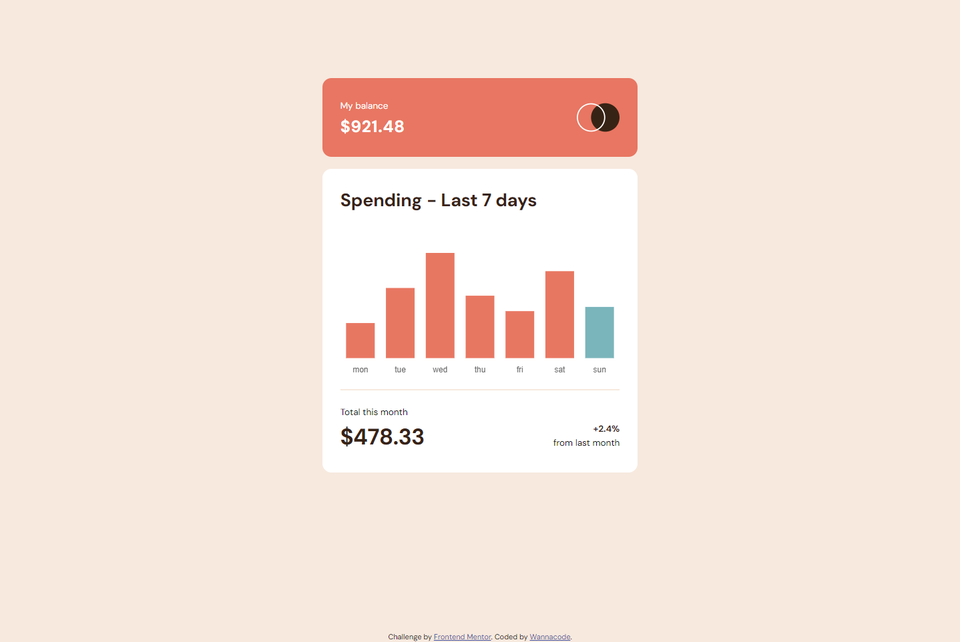
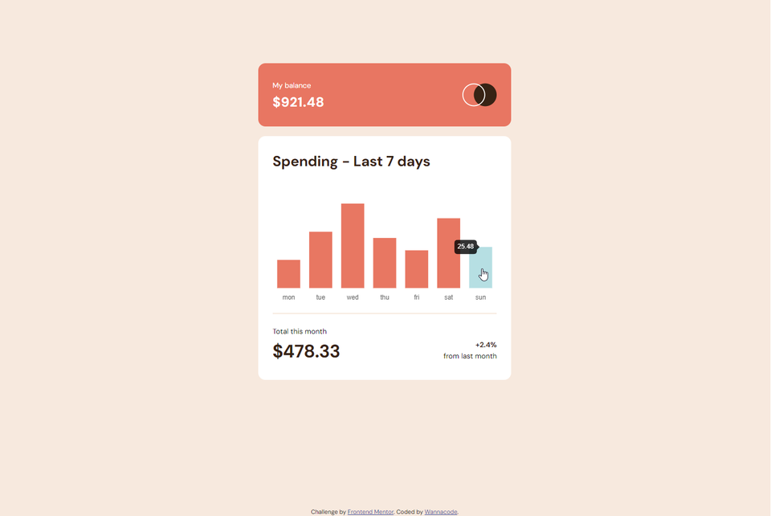
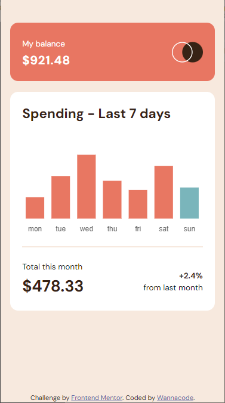
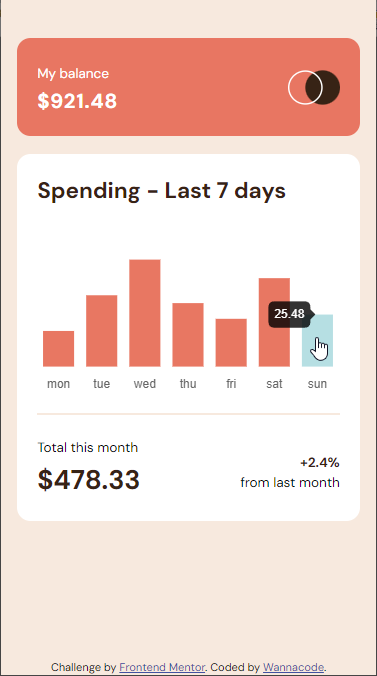
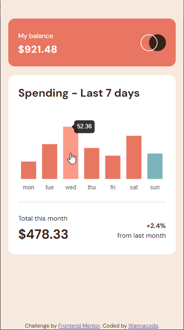

# Frontend Mentor - Expenses chart component solution

This is a solution to the [Expenses chart component challenge on Frontend Mentor](https://www.frontendmentor.io/challenges/expenses-chart-component-e7yJBUdjwt). Frontend Mentor challenges help you improve your coding skills by building realistic projects. 

## Table of contents

- [Overview](#overview)
  - [The challenge](#the-challenge)
  - [Screenshot](#screenshot)
  - [Links](#links)
- [My process](#my-process)
  - [Built with](#built-with)
  - [What I learned](#what-i-learned)
  - [Continued development](#continued-development)
  - [Useful resources](#useful-resources)
- [Author](#author)
- [Acknowledgments](#acknowledgments)

## Overview

### The challenge

Users should be able to:

- View the bar chart and hover over the individual bars to see the correct amounts for each day
- See the current day’s bar highlighted in a different colour to the other bars
- View the optimal layout for the content depending on their device’s screen size
- See hover states for all interactive elements on the page
- **Bonus**: Use the JSON data file provided to dynamically size the bars on the chart

### Screenshot







### Links

- Solution URL: [Solution URL here](https://github.com/kwngptrl/FEM-expenses-chart-component-main)
- Live Site URL: [Live site URL here](https://kwngptrl.github.io/FEM-expenses-chart-component-main/)

## My process

### Built with

- Semantic HTML5 markup
- CSS custom properties
- Vanilla JS
- Flexbox
- CSS Grid
- Mobile-first workflow
- [Chart.js](https://www.chartjs.org/) - JS library

### What I learned

When I saw this challenge some time ago my first thought was, "This is where I'm going to use a library." And so I did, this is the first time I'm using a library (although just through a CDN). I used Chart.js for this and as for the experience I would say that the using library docs was a bit rough for me. I ended up watching videos which slowed me a bit, but still managed to get most of the requirements done.

To recap: The HTML, I'm not sure about the semantics/accessibility for a component. It didn't completely satisfy the browser's WAI-ARIA plugin. The CSS, nothing much here, just the usual with use of clamp for certain things. For the JS, it's mostly because of Chart.js. I think I got the sample code from the Chart.js site and then proceeded to change it. 

Since there was a JSON file included with the challenge, to fill the labels and dataset I mapped it into an array through an async/await block (including the colors, and hover colors). Now, there was the condition of, **"See the current day’s bar highlighted in a different colour to the other bars"**, for this I consulted StackOverflow where I found this post, [Day Name from Date in JS](https://stackoverflow.com/questions/24998624/day-name-from-date-in-js). The code is...
```js
const today = new Date().toLocaleDateString('en-US', {weekday: 'short'}).toLowerCase();
/* 
  other code in between
*/
const dayColors = datapoints.map(
  function(index){
    return index.day === today ? 'hsl(186, 34%, 60%)': 'hsl(10, 79%, 65%)';
  });
const hoverDayColors = datapoints.map(
  function(index){
    return index.day === today ? 'hsl(186, 47%, 80%)': 'hsl(10, 100%, 76%)';
  });
```

Now, depending on what day of the week it is, one will see that the current day's bar will be a different color from the others (as well as the hover colors). The rest of the JS code is Chart.js specific. The videos I watched to match this challenge's condition were the following:
- [Fetch and Display Advanced JSON Data in Chart JS - YouTube](https://www.youtube.com/watch?v=mw5i_QGDomw)
- [How to update charts with ChartJS [ the RIGHT way ]](https://www.youtube.com/watch?v=Ac5pzmHO3_A)
- [Chart JS Full Course For Beginners | Data Visualization](https://www.youtube.com/watch?v=w3JwNGusgN0)
- [How to Show Tooltip Color Boxes Only For Two Bars in Chart JS 4](https://www.youtube.com/watch?v=4dkgUh-5gvo)
- [How to Hide Numbers in Y-Axis Scales in Chart.js](https://www.youtube.com/watch?v=aKy0RHeQAXY)
- [How to Change Mouse Cursor Onhover on Bar Chart in Chart.js](https://www.youtube.com/watch?v=Uj_I2_7o0No)


### Continued development

One thing that I didn't do compared to the challenge was the tooltip is not on top of the each 'bar' without a tooltip arrow. I find the default in Chart.js to be nice enough. Perhaps additional padding around the values would work also.

### Useful resources

See the links above.

## Author

- Frontend Mentor - [@Wannacode](https://www.frontendmentor.io/profile/kwngptrl)

## Acknowledgments

This is where you can give a hat tip to anyone who helped you out on this project. Perhaps you worked in a team or got some inspiration from someone else's solution. This is the perfect place to give them some credit.

**Note: Delete this note and edit this section's content as necessary. If you completed this challenge by yourself, feel free to delete this section entirely.**
